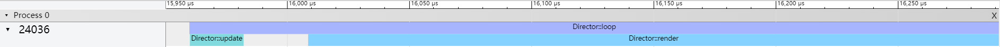

**zh** | [en]

这是一个用于制作2D命令行游戏的框架.   

文档
----
👉 **[API参考]** (中文)  

特点 🎄
----
- 多平台: Linux, macOS, Windows.
- 轻量.
- 拥有内置CPU抽样性能分析器.
- 使用实体-组件系统(ECS).

编译 ⛓
----
1. [设置Git]并[fork我们的仓库]. 如果您更倾向于不使用Git, 点击右上角的'Download ZIP'来下载zip格式的源代码.
2. 在文件管理器中打开源代码文件夹并执行'build.bat'. 这将下载子模块并使用CMake构建项目.

### CMake 选项 (默认 ON)
- `BUILD_EXAMPLES` 构建示例
- `BUILD_TESTS`    构建单元测试

截图 ✨
----

联系 💬
----
- **[Github Discussions]**
- **[Telegram]**

[en]:                 README.md
[API参考]:            https://shenmian.github.io/Clementine
[设置Git]:            https://help.github.com/articles/set-up-git
[fork我们的仓库]:      https://help.github.com/articles/fork-a-repo
[Github Discussions]: https://github.com/ShenMian/Clementine/discussions
[Telegram]:           https://t.me/shenmian
