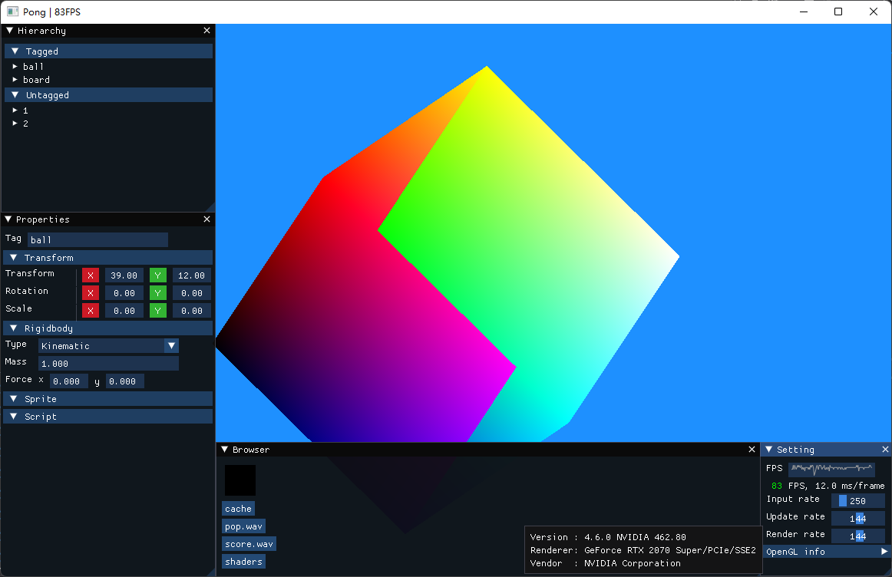

**cn** | [en]

**[特点](#特点) | [文档](#文档) | [编译](#编译) | [联系](#联系) | [截图](#截图)**

这是一个用于制作游戏的框架.  

特点
----
- 易用.
- 轻量.
- 多平台: Windows, Linux, macOS.

文档
----
- **[Github Wiki]**
- **[API 参考]** (中文)

[编译](Docs/Compiling.md)
----

联系
----
- **[Github Discussions]**
- **[Telegram]**

截图
----

**[更多...](Docs/pictures)**

[en]:                 README.md
[github wiki]:        https://github.com/ShenMian/Clementine/wiki
[api 参考]:           https://shenmian.github.io/Clementine
[设置git]:            https://help.github.com/articles/set-up-git
[fork我们的仓库]:      https://help.github.com/articles/fork-a-repo
[github discussions]: https://github.com/ShenMian/Clementine/discussions
[telegram]:           https://t.me/shenmian
