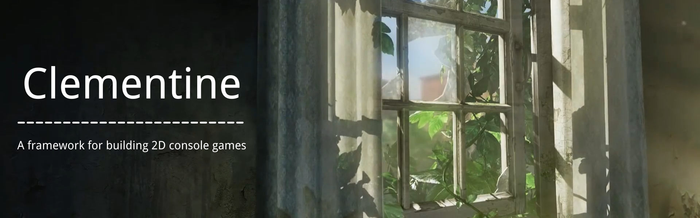
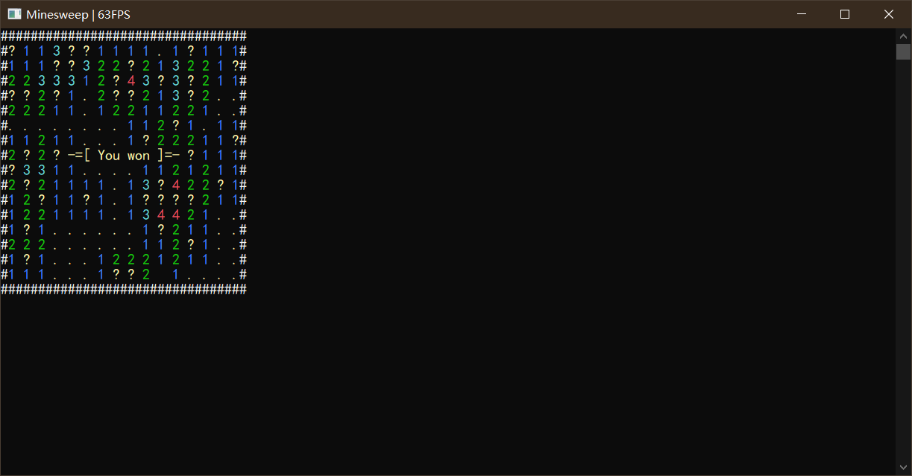
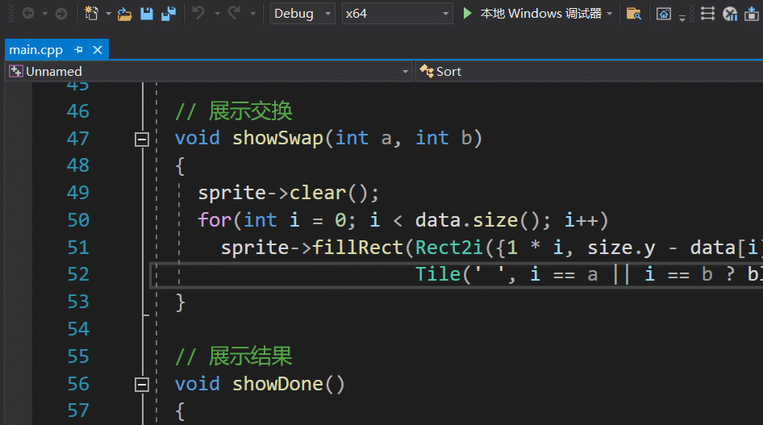
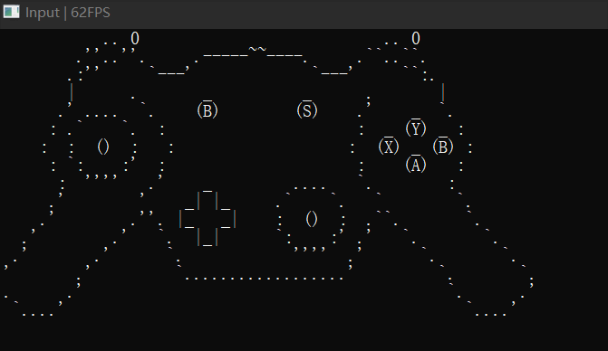
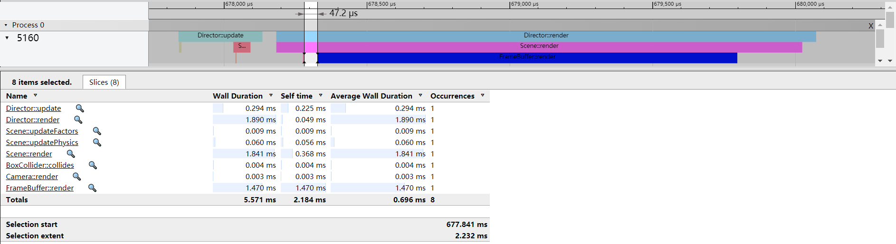

**zh** | [en]

**[特点](#特点) | [文档](#文档) | [截图](#截图) | [编译](#编译) | [联系](#联系)**

这是一个用于制作2D命令行游戏的框架.  

特点
----
- 多平台: Linux, macOS, Windows.
- 轻量.
- 拥有内置性能分析工具 (CPU抽样性能分析器).
- 使用实体-组件系统 (ECS).
- 子系统
  - [音频](https://github.com/ShenMian/Clementine/wiki/%E5%AD%90%E7%B3%BB%E7%BB%9F:-Audio)
  - 物理
  - 日志
  - 输入: 键盘, 鼠标, 手柄

文档
----
- **[Github Wiki]**
- **[API 参考]** (中文)

截图
----

编译
----
[设置Git]并[fork我们的仓库]. 如果您更倾向于不使用Git, 点击右上角的'Download ZIP'来下载zip格式的源代码.

### Premake
进入文件夹 'scripts' 并执行 'generate_[action]_project.sh'/'generate_[action]_project.bat'. 这将生成对应特定软件的项目文件.

#### Action 选项
- `vs2019` Visual Studio 2019
- `xcode4` Xcode4
- `gmake2` GNU Make 2

### CMake
进入文件夹 'scripts' 并执行 'build.sh'/'build.bat'. 这将下载子模块并使用 CMake 构建项目.

### CMake 选项 (默认 ON)
- `BUILD_EXAMPLES` 构建示例
- `BUILD_TESTS`    构建单元测试

联系
----
- **[Github Discussions]**
- **[Telegram]**

[en]:                 README.md
[github wiki]:        https://github.com/ShenMian/Clementine/wiki
[api 参考]:           https://shenmian.github.io/Clementine
[设置git]:            https://help.github.com/articles/set-up-git
[fork我们的仓库]:      https://help.github.com/articles/fork-a-repo
[github discussions]: https://github.com/ShenMian/Clementine/discussions
[telegram]:           https://t.me/shenmian
