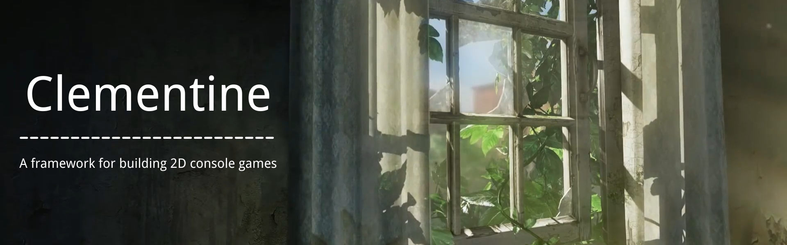
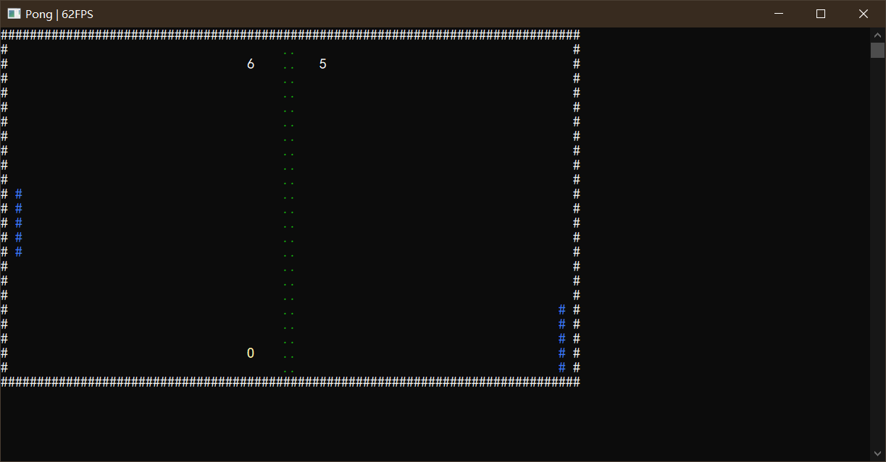
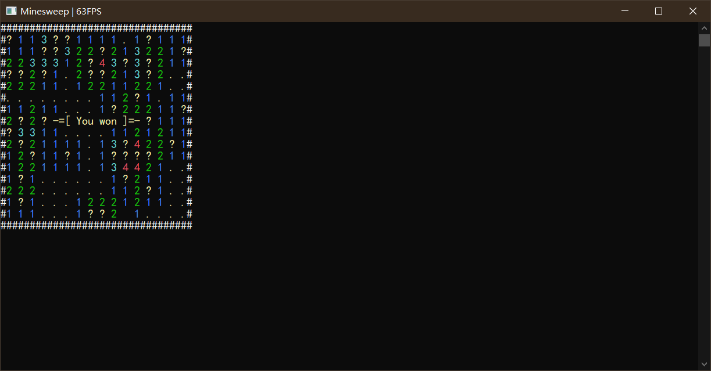
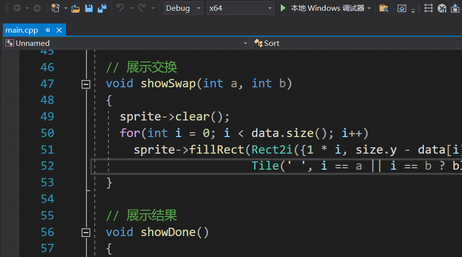
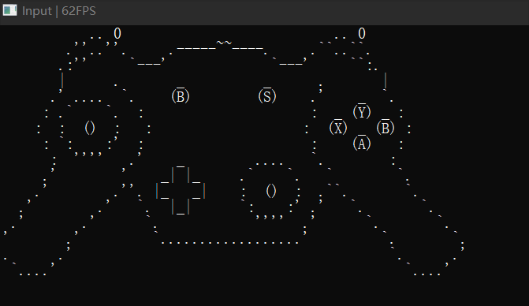
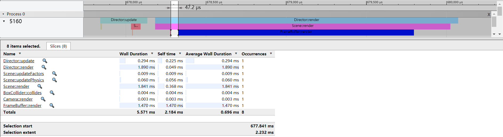

**en** | [cn]

**[Features](#features) | [Documentation](#documentation) | [Compiling](#compiling) | [Contact](#contact) | [Screenshots](#screenshots)**

This is a framework for building 2D console games.  

Features
--------
- Easy to use.
- Lightweight.
- Multi-platform: Windows, Linux, macOS.

Goals
-----
Make the framework as simple as possible and reduce the mental burden of users.

Documentation
-------------
- **[Github Wiki]**
- **[API Reference]** (Chinese)

Compiling
---------
[Set up Git] and [fork our repository].
If you'd prefer not to use Git, use the 'Download ZIP' button on the right to get the source as a zip file.

### Premake
Enter folder 'Scripts' and run 'generate_[action]_project.sh'/'generate_[action]_project.bat'. This will generate the project files corresponding to specific software.

#### Action options
- `vs2019` Visual Studio 2019
- `xcode4` Xcode4
- `gmake2` GNU Make 2

### CMake
Enter folder 'Scripts' and run 'build.sh'/'build.bat'. This will download submodules and use CMake to build project.

#### CMake Options (default ON)
- `BUILD_EXAMPLES` Build the examples
- `BUILD_TESTS`    Build the unit tests

Contact
-------
- **[Github Discussions]**
- **[Telegram]**

Screenshots
-----------

[cn]:                  README-cn.md
[github wiki]:         https://github.com/ShenMian/Clementine/wiki
[api reference]:       https://shenmian.github.io/Clementine
[set up git]:          https://help.github.com/articles/set-up-git
[fork our repository]: https://help.github.com/articles/fork-a-repo
[github discussions]:  https://github.com/ShenMian/Clementine/discussions
[telegram]:            https://t.me/shenmian
