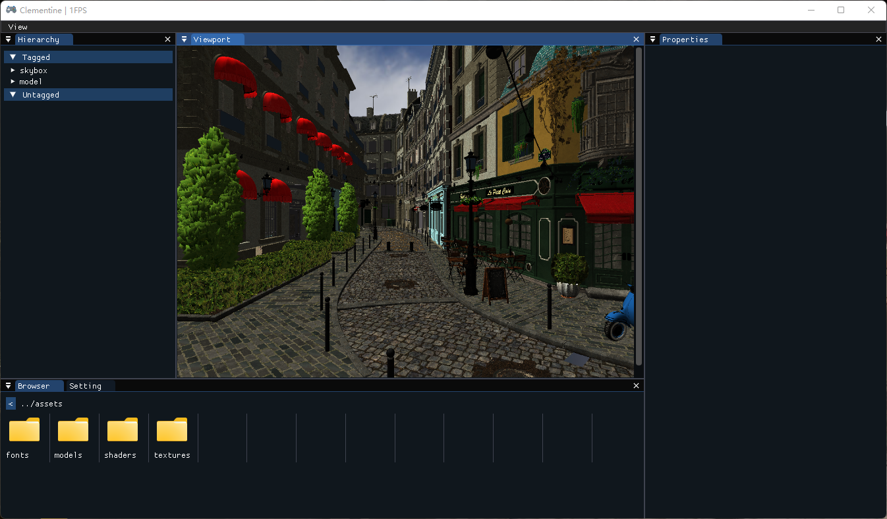

**en** | [cn]

**[Features](#features) | [Documentation](#documentation) | [Compiling](#compiling) | [Contact](#contact) | [Screenshots](#screenshots)**

This is a framework for building games.  

Features
--------
- Easy to use.
- Lightweight.
- Multi-platform: Windows, Linux, macOS.

Goals
-----
Make the framework as simple as possible and reduce the mental burden of users.

Documentation
-------------
- **[Github Wiki]**
- **[API Reference]** (Chinese)

[Compiling](Docs/Compiling.md)
-----------

Contact
-------
- **[Github Discussions]**
- **[Telegram]**

Screenshots
-----------

**[More...](Docs/pictures)**

[cn]:                  README-cn.md
[github wiki]:         https://github.com/ShenMian/Clementine/wiki
[api reference]:       https://shenmian.github.io/Clementine
[set up git]:          https://help.github.com/articles/set-up-git
[fork our repository]: https://help.github.com/articles/fork-a-repo
[github discussions]:  https://github.com/ShenMian/Clementine/discussions
[telegram]:            https://t.me/shenmian
